# Telegram Alert Map

This map is generated from normalized Telegram schedule records.

## Flow Chart

```mermaid
flowchart LR
    TG["Telegram Chat"]
    subgraph LIVE_SCHEDULER["Live Scheduler Tasks"]
        N_sector_heatmap["Sector Heatmap
15:30 HKT
Sector screenshot flow and heatmap capture"]
        N_morning_digest["Morning Digest
07:00 HKT
Morning synthesis across core sources"]
        N_daily_synthesis["Daily Synthesis
19:00 HKT
Evening multi-source synthesis update"]
        N_evening_digest["Evening Digest
21:00 HKT
Evening synthesis across core sources"]
        N_night_digest["Night Digest
23:30 HKT
Late-night synthesis across core sources"]
        N_crypto_etf_flow_am["Crypto ETF Flow (AM)
09:00 HKT
Pre-Market Crypto ETF cash flow summary"]
        N_crypto_etf_flow_mid["Crypto ETF Flow (Mid)
11:50 HKT
Midday Crypto ETF cash flow update"]
        N_crypto_news_daily["Crypto Daily News
11:00 HKT
Top 8 Chinese + English crypto headlines"]
        N_deepvue_dashboard["DeepVue Dashboard
15:30 HKT
DeepVue market overview and screen brief"]
        N_southbound["Southbound Flow
15:30 HKT
Southbound screenshot and screen brief"]
        N_jarvis_excel_sync_am["Jarvis Excel Sync AM
10:30 HKT
Excel sync workflow"]
        N_jarvis_excel_sync_pm["Jarvis Excel Sync PM
21:00 HKT
Excel sync workflow"]
        N_georisk["GeoRisk Update
20:00 HKT
Geopolitics risk monitor and Telegram update"]
        N_jarvis_cbbc_tracker_am["HK CBBC Tracker (牛熊證)
09:00 HKT
SG Warrants bull/bear distribution"]
        N_usdata["US Data Calendar
18:30 HKT
Calendar screenshot and macro data table"]
        N_jarvis_full["JARVIS Full
05:00 HKT
Full controller run"]
        N_jarvis_light_0950["JARVIS Light 09:50
09:50 HKT
Light controller run"]
        N_jarvis_light_2100["JARVIS Light 21:00
21:00 HKT
Light controller run"]
        N_jarvis_light_2230["JARVIS Light 22:30
22:30 HKT
Light controller run"]
        N_excel["Excel Reminder
10:00 HKT
Manual Excel and data reminder"]
        N_story_1030["Market Storyteller
10:30 HKT
Narrative market summary from storyteller model"]
        N_fundman_telegram_ops_listener["Fundman Telegram Ops Listener
00:01 HKT
Telegram operations listener"]
        N_schedule_audit["Telegram Schedule Audit
06:15 HKT
Cross-repo Telegram schedule drift audit"]
        N_options_earnings_2100["Options & Earnings Alert (21:00)
21:00 HKT
Expiring options contracts and Dash earnings reminder"]
        N_options_earnings_2330["Options & Earnings Alert (23:30)
23:30 HKT
Expiring options contracts and Dash earnings reminder"]
        N_p_model_check["P-model Check
05:00 HKT
Pre-market PAM / P-model signal check"]
        N_jarvis_portfolio_am["JARVIS Portfolio Commentary (AM)
09:00 HKT
Portfolio actions vs model signals"]
        N_jarvis_portfolio_pm["JARVIS Portfolio Commentary (PM)
20:30 HKT
Portfolio actions vs model signals"]
    end
    subgraph REPO_ONLY["Repo-defined / Not Currently Scheduled"]
        N_jarvis_light["Jarvis Light
n/a
run_light.bat"]
        N_scrape_cw["Scrape Cw
10:00 HKT
daily_reminders.py --task scrape_cw"]
        N_newsletter["Newsletter
11:00 HKT
daily_reminders.py --task newsletter"]
        N_northbound["Northbound
15:30 HKT
daily_reminders.py --task northbound"]
        N_scrape_p_model["Scrape P Model
20:00 HKT
daily_reminders.py --task scrape_p_model"]
        N_scrape_all["Scrape All
22:00 HKT
daily_reminders.py --task scrape_all"]
        N_scrape_pam["Scrape Pam
n/a
alias:scrape_pam->scrape_p_model"]
        N_portfolio_digest["JARVIS Portfolio Digest
n/a
Consolidated portfolio monitor digest"]
    end
    subgraph DISABLED["Disabled"]
        N_telegram_hub_hourly["Telegram Hub Hourly
16:26 HKT
Hourly cross-repo Telegram digest"]
    end
    N_sector_heatmap --> TG
    N_morning_digest --> TG
    N_daily_synthesis --> TG
    N_evening_digest --> TG
    N_night_digest --> TG
    N_crypto_etf_flow_am --> TG
    N_crypto_etf_flow_mid --> TG
    N_crypto_news_daily --> TG
    N_deepvue_dashboard --> TG
    N_southbound --> TG
    N_jarvis_excel_sync_am --> TG
    N_jarvis_excel_sync_pm --> TG
    N_georisk --> TG
    N_jarvis_cbbc_tracker_am --> TG
    N_usdata --> TG
    N_jarvis_full --> TG
    N_jarvis_light_0950 --> TG
    N_jarvis_light_2100 --> TG
    N_jarvis_light_2230 --> TG
    N_excel --> TG
    N_story_1030 --> TG
    N_fundman_telegram_ops_listener --> TG
    N_schedule_audit --> TG
    N_options_earnings_2100 --> TG
    N_options_earnings_2330 --> TG
    N_p_model_check --> TG
    N_jarvis_portfolio_am --> TG
    N_jarvis_portfolio_pm --> TG
    N_jarvis_light --> TG
    N_scrape_cw --> TG
    N_newsletter --> TG
    N_northbound --> TG
    N_scrape_p_model --> TG
    N_scrape_all --> TG
    N_scrape_pam --> TG
    N_portfolio_digest --> TG
    N_telegram_hub_hourly -.-> TG
```

## Why items were missing before

- The previous map was a manual summary rather than a full generated inventory.
- The audit engine did not model every sender wrapper, especially `Crypto ETF Flow (AM)` and `Crypto ETF Flow (Mid)`.
- Live scheduler state and repo-defined sender inventory were mixed together without explicit lane separation, which made `HK CBBC Tracker (牛熊證)` easy to drop from the visual.

## Live Scheduler Tasks

- `15:30 HKT` | **Sector Heatmap** | Sector screenshot flow and heatmap capture | `run_sector_screenshots.bat`
- `07:00 HKT` | **Morning Digest** | Morning synthesis across core sources | `daily_reminders.py --task morning_digest`
- `19:00 HKT` | **Daily Synthesis** | Evening multi-source synthesis update | `daily_reminders.py --task daily_synthesis`
- `21:00 HKT` | **Evening Digest** | Evening synthesis across core sources | `daily_reminders.py --task evening_digest`
- `23:30 HKT` | **Night Digest** | Late-night synthesis across core sources | `daily_reminders.py --task night_digest`
- `09:00 HKT` | **Crypto ETF Flow (AM)** | Pre-Market Crypto ETF cash flow summary | `run_crypto_etf_flows.bat morning`
- `11:50 HKT` | **Crypto ETF Flow (Mid)** | Midday Crypto ETF cash flow update | `run_crypto_etf_flows.bat midday`
- `11:00 HKT` | **Crypto Daily News** | Top 8 Chinese + English crypto headlines | `run_crypto_news.bat`
- `15:30 HKT` | **DeepVue Dashboard** | DeepVue market overview and screen brief | `run_deepvue_dashboard.bat`
- `15:30 HKT` | **Southbound Flow** | Southbound screenshot and screen brief | `daily_reminders.py --task southbound`
- `10:30 HKT` | **Jarvis Excel Sync AM** | Excel sync workflow | `run_excel_sync.bat`
- `21:00 HKT` | **Jarvis Excel Sync PM** | Excel sync workflow | `run_excel_sync.bat`
- `20:00 HKT` | **GeoRisk Update** | Geopolitics risk monitor and Telegram update | `daily_reminders.py --task georisk`
- `09:00 HKT` | **HK CBBC Tracker (牛熊證)** | SG Warrants bull/bear distribution | `send_cbbc_tracker.py`
- `18:30 HKT` | **US Data Calendar** | Calendar screenshot and macro data table | `daily_reminders.py --task usdata`
- `05:00 HKT` | **JARVIS Full** | Full controller run | `run_full.bat`
- `09:50 HKT` | **JARVIS Light 09:50** | Light controller run | `run_light.bat`
- `21:00 HKT` | **JARVIS Light 21:00** | Light controller run | `run_light.bat`
- `22:30 HKT` | **JARVIS Light 22:30** | Light controller run | `run_light.bat`
- `10:00 HKT` | **Excel Reminder** | Manual Excel and data reminder | `daily_reminders.py --task excel`
- `10:30 HKT` | **Market Storyteller** | Narrative market summary from storyteller model | `run_daily_reminder.bat story_1030`
- `00:01 HKT` | **Fundman Telegram Ops Listener** | Telegram operations listener | `start_ops_listener.bat`
- `06:15 HKT` | **Telegram Schedule Audit** | Cross-repo Telegram schedule drift audit | `run_schedule_audit.bat`
- `21:00 HKT` | **Options & Earnings Alert (21:00)** | Expiring options contracts and Dash earnings reminder | `run_options_expiry.bat`
- `23:30 HKT` | **Options & Earnings Alert (23:30)** | Expiring options contracts and Dash earnings reminder | `run_options_expiry.bat`
- `05:00 HKT` | **P-model Check** | Pre-market PAM / P-model signal check | `daily_reminders.py --task pam_check`
- `09:00 HKT` | **JARVIS Portfolio Commentary (AM)** | Portfolio actions vs model signals | `run_portfolio_commentary.bat`
- `20:30 HKT` | **JARVIS Portfolio Commentary (PM)** | Portfolio actions vs model signals | `run_portfolio_commentary.bat`

## Repo-defined / Not Currently Scheduled

- `n/a` | **Jarvis Light** | run_light.bat | `run_light.bat`
- `10:00 HKT` | **Scrape Cw** | daily_reminders.py --task scrape_cw | `daily_reminders.py --task scrape_cw`
- `11:00 HKT` | **Newsletter** | daily_reminders.py --task newsletter | `daily_reminders.py --task newsletter`
- `15:30 HKT` | **Northbound** | daily_reminders.py --task northbound | `daily_reminders.py --task northbound`
- `20:00 HKT` | **Scrape P Model** | daily_reminders.py --task scrape_p_model | `daily_reminders.py --task scrape_p_model`
- `22:00 HKT` | **Scrape All** | daily_reminders.py --task scrape_all | `daily_reminders.py --task scrape_all`
- `n/a` | **Scrape Pam** | alias:scrape_pam->scrape_p_model | `alias:scrape_pam->scrape_p_model`
- `n/a` | **JARVIS Portfolio Digest** | Consolidated portfolio monitor digest | `run_portfolio_digest.bat`

## Disabled

- `16:26 HKT` | **Telegram Hub Hourly** | Hourly cross-repo Telegram digest | `run_telegram_hub.bat`

## Inventory

| State | Time (HKT) | Display Name | Task Key | Source / Model | Runtime Path | Evidence |
|---|---|---|---|---|---|---|
| Live scheduler | 15:30 HKT | Sector Heatmap | `sector_heatmap` | Sector screenshot flow and heatmap capture | `run_sector_screenshots.bat` | Scheduler + repo |
| Live scheduler | 07:00 HKT | Morning Digest | `morning_digest` | Morning synthesis across core sources | `daily_reminders.py --task morning_digest` | Scheduler + repo |
| Live scheduler | 19:00 HKT | Daily Synthesis | `daily_synthesis` | Evening multi-source synthesis update | `daily_reminders.py --task daily_synthesis` | Scheduler + repo |
| Live scheduler | 21:00 HKT | Evening Digest | `evening_digest` | Evening synthesis across core sources | `daily_reminders.py --task evening_digest` | Scheduler + repo |
| Live scheduler | 23:30 HKT | Night Digest | `night_digest` | Late-night synthesis across core sources | `daily_reminders.py --task night_digest` | Scheduler + repo |
| Live scheduler | 09:00 HKT | Crypto ETF Flow (AM) | `crypto_etf_flow_am` | Pre-Market Crypto ETF cash flow summary | `run_crypto_etf_flows.bat morning` | Scheduler + repo |
| Live scheduler | 11:50 HKT | Crypto ETF Flow (Mid) | `crypto_etf_flow_mid` | Midday Crypto ETF cash flow update | `run_crypto_etf_flows.bat midday` | Scheduler + repo |
| Live scheduler | 11:00 HKT | Crypto Daily News | `crypto_news_daily` | Top 8 Chinese + English crypto headlines | `run_crypto_news.bat` | Scheduler + repo |
| Live scheduler | 15:30 HKT | DeepVue Dashboard | `deepvue_dashboard` | DeepVue market overview and screen brief | `run_deepvue_dashboard.bat` | Scheduler + repo |
| Live scheduler | 15:30 HKT | Southbound Flow | `southbound` | Southbound screenshot and screen brief | `daily_reminders.py --task southbound` | Scheduler + repo |
| Live scheduler | 10:30 HKT | Jarvis Excel Sync AM | `jarvis_excel_sync_am` | Excel sync workflow | `run_excel_sync.bat` | Scheduler + repo |
| Live scheduler | 21:00 HKT | Jarvis Excel Sync PM | `jarvis_excel_sync_pm` | Excel sync workflow | `run_excel_sync.bat` | Scheduler + repo |
| Live scheduler | 20:00 HKT | GeoRisk Update | `georisk` | Geopolitics risk monitor and Telegram update | `daily_reminders.py --task georisk` | Scheduler + repo |
| Live scheduler | 09:00 HKT | HK CBBC Tracker (牛熊證) | `jarvis_cbbc_tracker_am` | SG Warrants bull/bear distribution | `send_cbbc_tracker.py` | Scheduler + repo |
| Live scheduler | 18:30 HKT | US Data Calendar | `usdata` | Calendar screenshot and macro data table | `daily_reminders.py --task usdata` | Scheduler + repo |
| Live scheduler | 05:00 HKT | JARVIS Full | `jarvis_full` | Full controller run | `run_full.bat` | Scheduler + repo |
| Live scheduler | 09:50 HKT | JARVIS Light 09:50 | `jarvis_light_0950` | Light controller run | `run_light.bat` | Scheduler + repo |
| Live scheduler | 21:00 HKT | JARVIS Light 21:00 | `jarvis_light_2100` | Light controller run | `run_light.bat` | Scheduler + repo |
| Live scheduler | 22:30 HKT | JARVIS Light 22:30 | `jarvis_light_2230` | Light controller run | `run_light.bat` | Scheduler + repo |
| Live scheduler | 10:00 HKT | Excel Reminder | `excel` | Manual Excel and data reminder | `daily_reminders.py --task excel` | Scheduler + repo |
| Live scheduler | 10:30 HKT | Market Storyteller | `story_1030` | Narrative market summary from storyteller model | `run_daily_reminder.bat story_1030` | Scheduler + repo |
| Live scheduler | 00:01 HKT | Fundman Telegram Ops Listener | `fundman_telegram_ops_listener` | Telegram operations listener | `start_ops_listener.bat` | Scheduler + repo |
| Live scheduler | 06:15 HKT | Telegram Schedule Audit | `schedule_audit` | Cross-repo Telegram schedule drift audit | `run_schedule_audit.bat` | Scheduler + repo |
| Live scheduler | 21:00 HKT | Options &amp; Earnings Alert (21:00) | `options_earnings_2100` | Expiring options contracts and Dash earnings reminder | `run_options_expiry.bat` | Scheduler + repo |
| Live scheduler | 23:30 HKT | Options &amp; Earnings Alert (23:30) | `options_earnings_2330` | Expiring options contracts and Dash earnings reminder | `run_options_expiry.bat` | Scheduler + repo |
| Live scheduler | 05:00 HKT | P-model Check | `p_model_check` | Pre-market PAM / P-model signal check | `daily_reminders.py --task pam_check` | Scheduler + repo |
| Live scheduler | 09:00 HKT | JARVIS Portfolio Commentary (AM) | `jarvis_portfolio_am` | Portfolio actions vs model signals | `run_portfolio_commentary.bat` | Scheduler + repo |
| Live scheduler | 20:30 HKT | JARVIS Portfolio Commentary (PM) | `jarvis_portfolio_pm` | Portfolio actions vs model signals | `run_portfolio_commentary.bat` | Scheduler + repo |
| Repo only | n/a | Jarvis Light | `jarvis_light` | run_light.bat | `run_light.bat` | Repo only |
| Repo only | 10:00 HKT | Scrape Cw | `scrape_cw` | daily_reminders.py --task scrape_cw | `daily_reminders.py --task scrape_cw` | Repo only |
| Repo only | 11:00 HKT | Newsletter | `newsletter` | daily_reminders.py --task newsletter | `daily_reminders.py --task newsletter` | Repo only |
| Repo only | 15:30 HKT | Northbound | `northbound` | daily_reminders.py --task northbound | `daily_reminders.py --task northbound` | Repo only |
| Repo only | 20:00 HKT | Scrape P Model | `scrape_p_model` | daily_reminders.py --task scrape_p_model | `daily_reminders.py --task scrape_p_model` | Repo only |
| Repo only | 22:00 HKT | Scrape All | `scrape_all` | daily_reminders.py --task scrape_all | `daily_reminders.py --task scrape_all` | Repo only |
| Repo only | n/a | Scrape Pam | `scrape_pam` | alias:scrape_pam-&gt;scrape_p_model | `alias:scrape_pam->scrape_p_model` | Repo only |
| Repo only | n/a | JARVIS Portfolio Digest | `portfolio_digest` | Consolidated portfolio monitor digest | `run_portfolio_digest.bat` | Repo only |
| Disabled | 16:26 HKT | Telegram Hub Hourly | `telegram_hub_hourly` | Hourly cross-repo Telegram digest | `run_telegram_hub.bat` | Disabled scheduler |
