# Telegram Alert Map

This map is generated from normalized Telegram schedule records.

## Flow Chart

```mermaid
flowchart LR
    TG["Telegram Chat"]
    subgraph LIVE_SCHEDULER["Live Scheduler Tasks"]
        N_sector_heatmap["Sector Heatmap
15:30 HKT
Sector screenshot flow and heatmap capture"]
        N_commodity_live_overlay_0945["Commodity Model - Live Overlay Report
09:45 HKT
Fresh gold, silver, copper, and DXY live-overlay summary"]
        N_commodity_live_overlay_2145["Commodity Model - Live Overlay Report
21:45 HKT
Fresh gold, silver, copper, and DXY live-overlay summary"]
        N_cross_asset_momentum_0905["Cross-Asset Momentum (1D)
01:00 HKT, 09:05 HKT
One-day momentum snapshot across equity, dollar, gold, crypto, and vol proxies"]
        N_cross_asset_momentum_1145["Cross-Asset Momentum (1D)
11:45 HKT
One-day momentum snapshot across equity, dollar, gold, crypto, and vol proxies"]
        N_cross_asset_momentum_1545["Cross-Asset Momentum (1D)
15:45 HKT
One-day momentum snapshot across equity, dollar, gold, crypto, and vol proxies"]
        N_cross_asset_momentum_2100["Cross-Asset Momentum (1D)
21:00 HKT
One-day momentum snapshot across equity, dollar, gold, crypto, and vol proxies"]
        N_morning_digest["Morning Digest
07:00 HKT
Morning synthesis across core sources"]
        N_daily_synthesis["Daily Synthesis
19:00 HKT
Evening multi-source synthesis update"]
        N_evening_digest["Evening Digest
21:00 HKT
Evening synthesis across core sources"]
        N_night_digest["Night Digest
23:30 HKT
Late-night synthesis across core sources"]
        N_crypto_etf_flow_am["Crypto ETF Flow (AM)
09:00 HKT
Pre-Market Crypto ETF cash flow summary"]
        N_crypto_etf_flow_mid["Crypto ETF Flow (Mid)
11:50 HKT
Midday Crypto ETF cash flow update"]
        N_crypto_news_1000["Crypto Daily News
10:00 HKT
Top 8 Chinese + English crypto headlines"]
        N_crypto_news_daily["Crypto Daily News
11:00 HKT
Top 8 Chinese + English crypto headlines"]
        N_crypto_news_1140["Crypto Daily News
11:40 HKT
Top 8 Chinese + English crypto headlines"]
        N_deepvue_dashboard["DeepVue Dashboard
15:30 HKT
DeepVue market overview and screen brief"]
        N_pre_catalyst_alerts["Pre-Catalyst Earnings Alerts
09:08 HKT, 21:03 HKT
T-4 to T-10 earnings entry window and Fed tone shift checks"]
        N_pre_catalyst_alert["Pre-Catalyst Alert
18:29 HKT
Single pre-catalyst earnings alert wrapper"]
        N_earnings_signal_1800["Pre-Earnings Composite Signal
18:00 HKT
Pre-earnings PCR, analyst, sentiment, and momentum composite"]
        N_southbound_1230["Southbound Flow
12:30 HKT
Midday Southbound screenshot and screen brief"]
        N_southbound["Southbound Flow
15:30 HKT
Southbound screenshot and screen brief"]
        N_jarvis_excel_sync_am["Jarvis Excel Sync AM
12:10 HKT, 10:30 HKT
Excel sync workflow"]
        N_jarvis_excel_sync_late["Jarvis Excel Sync Late
23:50 HKT
run_excel_sync.bat"]
        N_futu_signals["Futu HSI Options Signals
09:45 HKT
Real-time HSI options signals after market open"]
        N_gdrive_breadth_regime_2045["GDrive Breadth & Regime Snapshot
20:45 HKT
Breadth, stage, regime, and factor snapshot from the daily GDrive recap"]
        N_georisk["GeoRisk Update
20:00 HKT
Geopolitics risk monitor and Telegram update"]
        N_jarvis_cbbc_tracker_am["HK CBBC Tracker (牛熊證)
09:00 HKT
SG Warrants bull/bear distribution"]
        N_friday_options["HSI Options Daily Check
17:00 HKT
End-of-day HSI options volume and put/call anomaly check"]
        N_friday_volume["HSI Opening Volume
09:30 HKT
HSI futures opening volume/OI baseline with Friday spike alert"]
        N_usdata["US Data Calendar
18:30 HKT
Calendar screenshot and macro data table"]
        N_jarvis_full["JARVIS Full
05:00 HKT
Full controller run"]
        N_jarvis_light_0950["JARVIS Light 09:50
09:50 HKT
Light controller run"]
        N_jarvis_light_2100["JARVIS Light 21:00
21:00 HKT
Light controller run"]
        N_jarvis_light_2230["JARVIS Light 22:30
22:30 HKT
Light controller run"]
        N_story_1030["Market Storyteller
10:30 HKT
Narrative market summary from storyteller model"]
        N_sentiment_scan_0133["Sentiment Scan (01:33)
01:33 HKT
Futu/OpenD watchlist sentiment scan"]
        N_sentiment_scan_1000["Sentiment Scan (10:00)
10:00 HKT
Futu/OpenD watchlist sentiment scan"]
        N_sentiment_scan_1146["Sentiment Scan (11:46)
11:46 HKT
Futu/OpenD watchlist sentiment scan"]
        N_sentiment_scan_1515["Sentiment Scan (15:15)
15:15 HKT
Futu/OpenD watchlist sentiment scan"]
        N_sentiment_scan_2310["Sentiment Scan (23:10)
23:10 HKT
Futu/OpenD watchlist sentiment scan"]
        N_newsletter["Newsletter
11:00 HKT
Generate newsletter, publish site, and send the live link to Telegram"]
        N_fundman_telegram_ops_listener["Fundman Telegram Ops Listener
00:01 HKT
Telegram operations listener"]
        N_schedule_audit["Telegram Schedule Audit
06:05 HKT, 15:40 HKT, 22:35 HKT
Cross-repo Telegram schedule drift audit"]
        N_options_earnings_2100["Options & Earnings Alert (21:00)
21:00 HKT
Expiring options contracts and Dash earnings reminder"]
        N_options_earnings_2330["Options & Earnings Alert (23:30)
23:30 HKT
Expiring options contracts and Dash earnings reminder"]
        N_jarvis_infohub_crawl_0115["Jarvis InfoHub Crawl 0115
01:15 HKT
run_infohub_crawl_scheduled.ps1"]
        N_jarvis_sector_universe_expand["Jarvis Sector Universe Expand
08:00 HKT
expand_sector_universe.py --daily"]
        N_jarvis_infohub_0830["Jarvis-InfoHub-0830
08:30 HKT
run_infohub_bridge.bat"]
        N_jarvis_shadow_sleeve_monday["Jarvis Shadow Sleeve Monday
09:00 HKT
run_shadow_sleeve_check.bat"]
        N_jarvis_shadow_sleeve_wednesday["Jarvis Shadow Sleeve Wednesday
09:00 HKT
run_shadow_sleeve_check.bat"]
        N_jarvis_sector_momentum_0905["Jarvis Sector Momentum 0905
09:05 HKT
send_sector_momentum.py"]
        N_jarvis_sector_stock_momentum_0915["Jarvis Sector Stock Momentum 0915
09:15 HKT
send_sector_stock_momentum.py"]
        N_jarvis_infohub_0915["Jarvis-InfoHub-0915
09:15 HKT
run_infohub_bridge.bat"]
        N_jarvis_futu_option_exercise_alert_0918["Jarvis Futu Option Exercise Alert 0918
09:18 HKT
run_futu_option_exercise_alert.bat"]
        N_jarvis_infohub_crawl_0945["Jarvis InfoHub Crawl 0945
09:45 HKT
run_infohub_crawl_scheduled.ps1"]
        N_jarvis_infohub_1130["Jarvis-InfoHub-1130
11:30 HKT
run_infohub_bridge.bat"]
        N_jarvis_sector_momentum_1145["Jarvis Sector Momentum 1145
11:45 HKT
send_sector_momentum.py"]
        N_jarvis_sector_stock_momentum_1155["Jarvis Sector Stock Momentum 1155
11:55 HKT
send_sector_stock_momentum.py"]
        N_jarvis_daily_market_report_1230["Jarvis Daily Market Report 1230
12:30 HKT
run_daily_market_report.ps1 -SendTelegram"]
        N_ciovacco_weekly_feed["Ciovacco-Weekly-Feed
14:00 HKT
run_ciovacco_weekly.bat"]
        N_jarvis_infohub_crawl_1500["Jarvis InfoHub Crawl 1500
15:00 HKT
run_infohub_crawl_scheduled.ps1"]
        N_jarvis_futu_option_exercise_alert_1518["Jarvis Futu Option Exercise Alert 1518
15:18 HKT
run_futu_option_exercise_alert.bat"]
        N_jarvis_infohub_1520["Jarvis-InfoHub-1520
15:20 HKT
run_infohub_bridge.bat"]
        N_jarvis_sector_momentum_1545["Jarvis Sector Momentum 1545
15:45 HKT
send_sector_momentum.py"]
        N_jarvis_sector_stock_momentum_1555["Jarvis Sector Stock Momentum 1555
15:55 HKT
send_sector_stock_momentum.py"]
        N_jarvis_polymarketmonitordaily["Jarvis-PolymarketMonitorDaily
20:00 HKT
run_polymarket_monitor_daily.bat"]
        N_polymarket["JARVIS-Reminder-polymarket
20:05 HKT
run_daily_reminder.bat polymarket"]
        N_jarvis_infohub_2055["Jarvis-InfoHub-2055
20:55 HKT
run_infohub_bridge.bat"]
        N_jarvis_hotipo_premarket["JARVIS-HotIPO-Premarket
21:00 HKT
run_hotipo_scanner.bat premarket"]
        N_jarvis_sector_momentum_2100["Jarvis Sector Momentum 2100
21:00 HKT
send_sector_momentum.py"]
        N_jarvis_cot_refresh["JARVIS-COT-refresh
22:00 HKT, 08:00 HKT
run_cot_refresh.bat"]
        N_jarvis_hotipo_open["JARVIS-HotIPO-Open
22:00 HKT
run_hotipo_scanner.bat open"]
        N_blp_pdf_title_pipeline["BLP-PDF-Title-Pipeline
22:15 HKT
run_blp_title_pipeline.bat --folder 'C:\blp\data' --retag-all"]
        N_jarvis_infohub_crawl_2300["Jarvis InfoHub Crawl 2300
23:00 HKT
run_infohub_crawl_scheduled.ps1"]
        N_jarvis_futu_option_exercise_alert_2318["Jarvis Futu Option Exercise Alert 2318
23:18 HKT
run_futu_option_exercise_alert.bat"]
        N_fintwit_signal_monitor["FinTwit Signal Monitor
n/a
run_fintwit_monitor.bat"]
        N_jarvis_eodhd_stream["Jarvis EODHD Stream
n/a
run_eodhd_stream.bat"]
        N_jarvis_polymarketmonitor["Jarvis-PolymarketMonitor
n/a
run_polymarket_monitor.bat"]
        N_p_model_check["P-model Check
05:00 HKT
Pre-market PAM / P-model signal check"]
        N_jarvis_portfolio_am["JARVIS Portfolio Commentary (AM)
09:00 HKT
Portfolio actions vs model signals"]
        N_jarvis_portfolio_pm["JARVIS Portfolio Commentary (PM)
20:30 HKT
Portfolio actions vs model signals"]
    end
    subgraph REPO_ONLY["Repo-defined / Not Currently Scheduled"]
        N_jarvis_light["Jarvis Light
n/a
run_light.bat"]
        N_excel["Excel Reminder
10:00 HKT
Manual Excel and data reminder"]
        N_scrape_cw["Scrape Cw
10:00 HKT
daily_reminders.py --task scrape_cw"]
        N_northbound["Northbound
15:30 HKT
daily_reminders.py --task northbound"]
        N_scrape_p_model["Scrape P Model
20:00 HKT
daily_reminders.py --task scrape_p_model"]
        N_scrape_all["Scrape All
22:00 HKT
daily_reminders.py --task scrape_all"]
        N_scrape_pam["Scrape Pam
n/a
alias:scrape_pam->scrape_p_model"]
        N_portfolio_digest["JARVIS Portfolio Digest
n/a
Consolidated portfolio monitor digest"]
    end
    subgraph DISABLED["Disabled"]
        N_telegram_hub_hourly["Telegram Hub Hourly
16:26 HKT
Hourly cross-repo Telegram digest"]
        N_jarvis_excel_sync_pm["Jarvis Excel Sync PM
21:00 HKT
Excel sync workflow"]
    end
    N_sector_heatmap --> TG
    N_commodity_live_overlay_0945 --> TG
    N_commodity_live_overlay_2145 --> TG
    N_cross_asset_momentum_0905 --> TG
    N_cross_asset_momentum_1145 --> TG
    N_cross_asset_momentum_1545 --> TG
    N_cross_asset_momentum_2100 --> TG
    N_morning_digest --> TG
    N_daily_synthesis --> TG
    N_evening_digest --> TG
    N_night_digest --> TG
    N_crypto_etf_flow_am --> TG
    N_crypto_etf_flow_mid --> TG
    N_crypto_news_1000 --> TG
    N_crypto_news_daily --> TG
    N_crypto_news_1140 --> TG
    N_deepvue_dashboard --> TG
    N_pre_catalyst_alerts --> TG
    N_pre_catalyst_alert --> TG
    N_earnings_signal_1800 --> TG
    N_southbound_1230 --> TG
    N_southbound --> TG
    N_jarvis_excel_sync_am --> TG
    N_jarvis_excel_sync_late --> TG
    N_futu_signals --> TG
    N_gdrive_breadth_regime_2045 --> TG
    N_georisk --> TG
    N_jarvis_cbbc_tracker_am --> TG
    N_friday_options --> TG
    N_friday_volume --> TG
    N_usdata --> TG
    N_jarvis_full --> TG
    N_jarvis_light_0950 --> TG
    N_jarvis_light_2100 --> TG
    N_jarvis_light_2230 --> TG
    N_story_1030 --> TG
    N_sentiment_scan_0133 --> TG
    N_sentiment_scan_1000 --> TG
    N_sentiment_scan_1146 --> TG
    N_sentiment_scan_1515 --> TG
    N_sentiment_scan_2310 --> TG
    N_newsletter --> TG
    N_fundman_telegram_ops_listener --> TG
    N_schedule_audit --> TG
    N_options_earnings_2100 --> TG
    N_options_earnings_2330 --> TG
    N_jarvis_infohub_crawl_0115 --> TG
    N_jarvis_sector_universe_expand --> TG
    N_jarvis_infohub_0830 --> TG
    N_jarvis_shadow_sleeve_monday --> TG
    N_jarvis_shadow_sleeve_wednesday --> TG
    N_jarvis_sector_momentum_0905 --> TG
    N_jarvis_sector_stock_momentum_0915 --> TG
    N_jarvis_infohub_0915 --> TG
    N_jarvis_futu_option_exercise_alert_0918 --> TG
    N_jarvis_infohub_crawl_0945 --> TG
    N_jarvis_infohub_1130 --> TG
    N_jarvis_sector_momentum_1145 --> TG
    N_jarvis_sector_stock_momentum_1155 --> TG
    N_jarvis_daily_market_report_1230 --> TG
    N_ciovacco_weekly_feed --> TG
    N_jarvis_infohub_crawl_1500 --> TG
    N_jarvis_futu_option_exercise_alert_1518 --> TG
    N_jarvis_infohub_1520 --> TG
    N_jarvis_sector_momentum_1545 --> TG
    N_jarvis_sector_stock_momentum_1555 --> TG
    N_jarvis_polymarketmonitordaily --> TG
    N_polymarket --> TG
    N_jarvis_infohub_2055 --> TG
    N_jarvis_hotipo_premarket --> TG
    N_jarvis_sector_momentum_2100 --> TG
    N_jarvis_cot_refresh --> TG
    N_jarvis_hotipo_open --> TG
    N_blp_pdf_title_pipeline --> TG
    N_jarvis_infohub_crawl_2300 --> TG
    N_jarvis_futu_option_exercise_alert_2318 --> TG
    N_fintwit_signal_monitor --> TG
    N_jarvis_eodhd_stream --> TG
    N_jarvis_polymarketmonitor --> TG
    N_p_model_check --> TG
    N_jarvis_portfolio_am --> TG
    N_jarvis_portfolio_pm --> TG
    N_jarvis_light --> TG
    N_excel --> TG
    N_scrape_cw --> TG
    N_northbound --> TG
    N_scrape_p_model --> TG
    N_scrape_all --> TG
    N_scrape_pam --> TG
    N_portfolio_digest --> TG
    N_telegram_hub_hourly -.-> TG
    N_jarvis_excel_sync_pm -.-> TG
```

## Why items were missing before

- The previous map was a manual summary rather than a full generated inventory.
- The audit engine did not model every sender wrapper, especially `Crypto ETF Flow (AM)` and `Crypto ETF Flow (Mid)`.
- Live scheduler state and repo-defined sender inventory were mixed together without explicit lane separation, which made `HK CBBC Tracker (牛熊證)` easy to drop from the visual.

## Live Scheduler Tasks

- `15:30 HKT` | **Sector Heatmap** | Sector screenshot flow and heatmap capture | `run_sector_screenshots.bat`
- `09:45 HKT` | **Commodity Model - Live Overlay Report** | Fresh gold, silver, copper, and DXY live-overlay summary | `run_commodity_live_overlay_report.bat 0945`
- `21:45 HKT` | **Commodity Model - Live Overlay Report** | Fresh gold, silver, copper, and DXY live-overlay summary | `run_commodity_live_overlay_report.bat 2145`
- `01:00 HKT, 09:05 HKT` | **Cross-Asset Momentum (1D)** | One-day momentum snapshot across equity, dollar, gold, crypto, and vol proxies | `send_cross_asset_momentum.py --slot 0905`
- `11:45 HKT` | **Cross-Asset Momentum (1D)** | One-day momentum snapshot across equity, dollar, gold, crypto, and vol proxies | `send_cross_asset_momentum.py --slot 1145`
- `15:45 HKT` | **Cross-Asset Momentum (1D)** | One-day momentum snapshot across equity, dollar, gold, crypto, and vol proxies | `send_cross_asset_momentum.py --slot 1545`
- `21:00 HKT` | **Cross-Asset Momentum (1D)** | One-day momentum snapshot across equity, dollar, gold, crypto, and vol proxies | `send_cross_asset_momentum.py --slot 2100`
- `07:00 HKT` | **Morning Digest** | Morning synthesis across core sources | `daily_reminders.py --task morning_digest`
- `19:00 HKT` | **Daily Synthesis** | Evening multi-source synthesis update | `daily_reminders.py --task daily_synthesis`
- `21:00 HKT` | **Evening Digest** | Evening synthesis across core sources | `daily_reminders.py --task evening_digest`
- `23:30 HKT` | **Night Digest** | Late-night synthesis across core sources | `daily_reminders.py --task night_digest`
- `09:00 HKT` | **Crypto ETF Flow (AM)** | Pre-Market Crypto ETF cash flow summary | `run_crypto_etf_flows.bat morning`
- `11:50 HKT` | **Crypto ETF Flow (Mid)** | Midday Crypto ETF cash flow update | `run_crypto_etf_flows.bat midday`
- `10:00 HKT` | **Crypto Daily News** | Top 8 Chinese + English crypto headlines | `run_crypto_news.bat 1000`
- `11:00 HKT` | **Crypto Daily News** | Top 8 Chinese + English crypto headlines | `run_crypto_news.bat`
- `11:40 HKT` | **Crypto Daily News** | Top 8 Chinese + English crypto headlines | `run_crypto_news.bat 1140`
- `15:30 HKT` | **DeepVue Dashboard** | DeepVue market overview and screen brief | `run_deepvue_dashboard_alert.bat`
- `09:08 HKT, 21:03 HKT` | **Pre-Catalyst Earnings Alerts** | T-4 to T-10 earnings entry window and Fed tone shift checks | `run_pre_catalyst_alerts.bat`
- `18:29 HKT` | **Pre-Catalyst Alert** | Single pre-catalyst earnings alert wrapper | `run_pre_catalyst_alert.bat`
- `18:00 HKT` | **Pre-Earnings Composite Signal** | Pre-earnings PCR, analyst, sentiment, and momentum composite | `send_earnings_signal.py --slot 1800`
- `12:30 HKT` | **Southbound Flow** | Midday Southbound screenshot and screen brief | `daily_reminders.py --task southbound_1230`
- `15:30 HKT` | **Southbound Flow** | Southbound screenshot and screen brief | `daily_reminders.py --task southbound`
- `12:10 HKT, 10:30 HKT` | **Jarvis Excel Sync AM** | Excel sync workflow | `run_excel_sync.bat`
- `23:50 HKT` | **Jarvis Excel Sync Late** | run_excel_sync.bat | `run_excel_sync.bat`
- `09:45 HKT` | **Futu HSI Options Signals** | Real-time HSI options signals after market open | `run_futu_signals.bat`
- `20:45 HKT` | **GDrive Breadth & Regime Snapshot** | Breadth, stage, regime, and factor snapshot from the daily GDrive recap | `run_gdrive_breadth_regime_snapshot.bat`
- `20:00 HKT` | **GeoRisk Update** | Geopolitics risk monitor and Telegram update | `daily_reminders.py --task georisk`
- `09:00 HKT` | **HK CBBC Tracker (牛熊證)** | SG Warrants bull/bear distribution | `send_cbbc_tracker.py`
- `17:00 HKT` | **HSI Options Daily Check** | End-of-day HSI options volume and put/call anomaly check | `run_friday_options.bat`
- `09:30 HKT` | **HSI Opening Volume** | HSI futures opening volume/OI baseline with Friday spike alert | `run_friday_volume.bat`
- `18:30 HKT` | **US Data Calendar** | Calendar screenshot and macro data table | `daily_reminders.py --task usdata`
- `05:00 HKT` | **JARVIS Full** | Full controller run | `run_full.bat`
- `09:50 HKT` | **JARVIS Light 09:50** | Light controller run | `run_light.bat`
- `21:00 HKT` | **JARVIS Light 21:00** | Light controller run | `run_light.bat`
- `22:30 HKT` | **JARVIS Light 22:30** | Light controller run | `run_light.bat`
- `10:30 HKT` | **Market Storyteller** | Narrative market summary from storyteller model | `run_daily_reminder.bat story_1030`
- `01:33 HKT` | **Sentiment Scan (01:33)** | Futu/OpenD watchlist sentiment scan | `send_sentiment_scan.py`
- `10:00 HKT` | **Sentiment Scan (10:00)** | Futu/OpenD watchlist sentiment scan | `send_sentiment_scan.py`
- `11:46 HKT` | **Sentiment Scan (11:46)** | Futu/OpenD watchlist sentiment scan | `send_sentiment_scan.py`
- `15:15 HKT` | **Sentiment Scan (15:15)** | Futu/OpenD watchlist sentiment scan | `send_sentiment_scan.py`
- `23:10 HKT` | **Sentiment Scan (23:10)** | Futu/OpenD watchlist sentiment scan | `send_sentiment_scan.py`
- `11:00 HKT` | **Newsletter** | Generate newsletter, publish site, and send the live link to Telegram | `daily_reminders.py --task newsletter`
- `00:01 HKT` | **Fundman Telegram Ops Listener** | Telegram operations listener | `start_ops_listener.bat`
- `06:05 HKT, 15:40 HKT, 22:35 HKT` | **Telegram Schedule Audit** | Cross-repo Telegram schedule drift audit | `run_schedule_audit.bat`
- `21:00 HKT` | **Options & Earnings Alert (21:00)** | Expiring options contracts and Dash earnings reminder | `run_options_expiry.bat`
- `23:30 HKT` | **Options & Earnings Alert (23:30)** | Expiring options contracts and Dash earnings reminder | `run_options_expiry.bat`
- `01:15 HKT` | **Jarvis InfoHub Crawl 0115** | run_infohub_crawl_scheduled.ps1 | `run_infohub_crawl_scheduled.ps1`
- `08:00 HKT` | **Jarvis Sector Universe Expand** | expand_sector_universe.py --daily | `expand_sector_universe.py --daily`
- `08:30 HKT` | **Jarvis-InfoHub-0830** | run_infohub_bridge.bat | `run_infohub_bridge.bat`
- `09:00 HKT` | **Jarvis Shadow Sleeve Monday** | run_shadow_sleeve_check.bat | `run_shadow_sleeve_check.bat`
- `09:00 HKT` | **Jarvis Shadow Sleeve Wednesday** | run_shadow_sleeve_check.bat | `run_shadow_sleeve_check.bat`
- `09:05 HKT` | **Jarvis Sector Momentum 0905** | send_sector_momentum.py | `send_sector_momentum.py`
- `09:15 HKT` | **Jarvis Sector Stock Momentum 0915** | send_sector_stock_momentum.py | `send_sector_stock_momentum.py`
- `09:15 HKT` | **Jarvis-InfoHub-0915** | run_infohub_bridge.bat | `run_infohub_bridge.bat`
- `09:18 HKT` | **Jarvis Futu Option Exercise Alert 0918** | run_futu_option_exercise_alert.bat | `run_futu_option_exercise_alert.bat`
- `09:45 HKT` | **Jarvis InfoHub Crawl 0945** | run_infohub_crawl_scheduled.ps1 | `run_infohub_crawl_scheduled.ps1`
- `11:30 HKT` | **Jarvis-InfoHub-1130** | run_infohub_bridge.bat | `run_infohub_bridge.bat`
- `11:45 HKT` | **Jarvis Sector Momentum 1145** | send_sector_momentum.py | `send_sector_momentum.py`
- `11:55 HKT` | **Jarvis Sector Stock Momentum 1155** | send_sector_stock_momentum.py | `send_sector_stock_momentum.py`
- `12:30 HKT` | **Jarvis Daily Market Report 1230** | run_daily_market_report.ps1 -SendTelegram | `run_daily_market_report.ps1 -SendTelegram`
- `14:00 HKT` | **Ciovacco-Weekly-Feed** | run_ciovacco_weekly.bat | `run_ciovacco_weekly.bat`
- `15:00 HKT` | **Jarvis InfoHub Crawl 1500** | run_infohub_crawl_scheduled.ps1 | `run_infohub_crawl_scheduled.ps1`
- `15:18 HKT` | **Jarvis Futu Option Exercise Alert 1518** | run_futu_option_exercise_alert.bat | `run_futu_option_exercise_alert.bat`
- `15:20 HKT` | **Jarvis-InfoHub-1520** | run_infohub_bridge.bat | `run_infohub_bridge.bat`
- `15:45 HKT` | **Jarvis Sector Momentum 1545** | send_sector_momentum.py | `send_sector_momentum.py`
- `15:55 HKT` | **Jarvis Sector Stock Momentum 1555** | send_sector_stock_momentum.py | `send_sector_stock_momentum.py`
- `20:00 HKT` | **Jarvis-PolymarketMonitorDaily** | run_polymarket_monitor_daily.bat | `run_polymarket_monitor_daily.bat`
- `20:05 HKT` | **JARVIS-Reminder-polymarket** | run_daily_reminder.bat polymarket | `run_daily_reminder.bat polymarket`
- `20:55 HKT` | **Jarvis-InfoHub-2055** | run_infohub_bridge.bat | `run_infohub_bridge.bat`
- `21:00 HKT` | **JARVIS-HotIPO-Premarket** | run_hotipo_scanner.bat premarket | `run_hotipo_scanner.bat premarket`
- `21:00 HKT` | **Jarvis Sector Momentum 2100** | send_sector_momentum.py | `send_sector_momentum.py`
- `22:00 HKT, 08:00 HKT` | **JARVIS-COT-refresh** | run_cot_refresh.bat | `run_cot_refresh.bat`
- `22:00 HKT` | **JARVIS-HotIPO-Open** | run_hotipo_scanner.bat open | `run_hotipo_scanner.bat open`
- `22:15 HKT` | **BLP-PDF-Title-Pipeline** | run_blp_title_pipeline.bat --folder "C:\blp\data" --retag-all | `run_blp_title_pipeline.bat --folder "C:\blp\data" --retag-all`
- `23:00 HKT` | **Jarvis InfoHub Crawl 2300** | run_infohub_crawl_scheduled.ps1 | `run_infohub_crawl_scheduled.ps1`
- `23:18 HKT` | **Jarvis Futu Option Exercise Alert 2318** | run_futu_option_exercise_alert.bat | `run_futu_option_exercise_alert.bat`
- `n/a` | **FinTwit Signal Monitor** | run_fintwit_monitor.bat | `run_fintwit_monitor.bat`
- `n/a` | **Jarvis EODHD Stream** | run_eodhd_stream.bat | `run_eodhd_stream.bat`
- `n/a` | **Jarvis-PolymarketMonitor** | run_polymarket_monitor.bat | `run_polymarket_monitor.bat`
- `05:00 HKT` | **P-model Check** | Pre-market PAM / P-model signal check | `daily_reminders.py --task pam_check`
- `09:00 HKT` | **JARVIS Portfolio Commentary (AM)** | Portfolio actions vs model signals | `run_portfolio_commentary.bat`
- `20:30 HKT` | **JARVIS Portfolio Commentary (PM)** | Portfolio actions vs model signals | `run_portfolio_commentary.bat`

## Repo-defined / Not Currently Scheduled

- `n/a` | **Jarvis Light** | run_light.bat | `run_light.bat`
- `10:00 HKT` | **Excel Reminder** | Manual Excel and data reminder | `daily_reminders.py --task excel`
- `10:00 HKT` | **Scrape Cw** | daily_reminders.py --task scrape_cw | `daily_reminders.py --task scrape_cw`
- `15:30 HKT` | **Northbound** | daily_reminders.py --task northbound | `daily_reminders.py --task northbound`
- `20:00 HKT` | **Scrape P Model** | daily_reminders.py --task scrape_p_model | `daily_reminders.py --task scrape_p_model`
- `22:00 HKT` | **Scrape All** | daily_reminders.py --task scrape_all | `daily_reminders.py --task scrape_all`
- `n/a` | **Scrape Pam** | alias:scrape_pam->scrape_p_model | `alias:scrape_pam->scrape_p_model`
- `n/a` | **JARVIS Portfolio Digest** | Consolidated portfolio monitor digest | `run_portfolio_digest.bat`

## Disabled

- `16:26 HKT` | **Telegram Hub Hourly** | Hourly cross-repo Telegram digest | `run_telegram_hub.bat`
- `21:00 HKT` | **Jarvis Excel Sync PM** | Excel sync workflow | `run_excel_sync.bat`

## Inventory

| State | Time (HKT) | Display Name | Task Key | Source / Model | Runtime Path | Evidence |
|---|---|---|---|---|---|---|
| Live scheduler | 15:30 HKT | Sector Heatmap | `sector_heatmap` | Sector screenshot flow and heatmap capture | `run_sector_screenshots.bat` | Scheduler + repo |
| Live scheduler | 09:45 HKT | Commodity Model - Live Overlay Report | `commodity_live_overlay_0945` | Fresh gold, silver, copper, and DXY live-overlay summary | `run_commodity_live_overlay_report.bat 0945` | Scheduler + repo |
| Live scheduler | 21:45 HKT | Commodity Model - Live Overlay Report | `commodity_live_overlay_2145` | Fresh gold, silver, copper, and DXY live-overlay summary | `run_commodity_live_overlay_report.bat 2145` | Scheduler + repo |
| Live scheduler | 01:00 HKT, 09:05 HKT | Cross-Asset Momentum (1D) | `cross_asset_momentum_0905` | One-day momentum snapshot across equity, dollar, gold, crypto, and vol proxies | `send_cross_asset_momentum.py --slot 0905` | Scheduler + repo |
| Live scheduler | 11:45 HKT | Cross-Asset Momentum (1D) | `cross_asset_momentum_1145` | One-day momentum snapshot across equity, dollar, gold, crypto, and vol proxies | `send_cross_asset_momentum.py --slot 1145` | Scheduler + repo |
| Live scheduler | 15:45 HKT | Cross-Asset Momentum (1D) | `cross_asset_momentum_1545` | One-day momentum snapshot across equity, dollar, gold, crypto, and vol proxies | `send_cross_asset_momentum.py --slot 1545` | Scheduler + repo |
| Live scheduler | 21:00 HKT | Cross-Asset Momentum (1D) | `cross_asset_momentum_2100` | One-day momentum snapshot across equity, dollar, gold, crypto, and vol proxies | `send_cross_asset_momentum.py --slot 2100` | Scheduler + repo |
| Live scheduler | 07:00 HKT | Morning Digest | `morning_digest` | Morning synthesis across core sources | `daily_reminders.py --task morning_digest` | Scheduler + repo |
| Live scheduler | 19:00 HKT | Daily Synthesis | `daily_synthesis` | Evening multi-source synthesis update | `daily_reminders.py --task daily_synthesis` | Scheduler + repo |
| Live scheduler | 21:00 HKT | Evening Digest | `evening_digest` | Evening synthesis across core sources | `daily_reminders.py --task evening_digest` | Scheduler + repo |
| Live scheduler | 23:30 HKT | Night Digest | `night_digest` | Late-night synthesis across core sources | `daily_reminders.py --task night_digest` | Scheduler + repo |
| Live scheduler | 09:00 HKT | Crypto ETF Flow (AM) | `crypto_etf_flow_am` | Pre-Market Crypto ETF cash flow summary | `run_crypto_etf_flows.bat morning` | Scheduler + repo |
| Live scheduler | 11:50 HKT | Crypto ETF Flow (Mid) | `crypto_etf_flow_mid` | Midday Crypto ETF cash flow update | `run_crypto_etf_flows.bat midday` | Scheduler + repo |
| Live scheduler | 10:00 HKT | Crypto Daily News | `crypto_news_1000` | Top 8 Chinese + English crypto headlines | `run_crypto_news.bat 1000` | Scheduler + repo |
| Live scheduler | 11:00 HKT | Crypto Daily News | `crypto_news_daily` | Top 8 Chinese + English crypto headlines | `run_crypto_news.bat` | Scheduler + repo |
| Live scheduler | 11:40 HKT | Crypto Daily News | `crypto_news_1140` | Top 8 Chinese + English crypto headlines | `run_crypto_news.bat 1140` | Scheduler + repo |
| Live scheduler | 15:30 HKT | DeepVue Dashboard | `deepvue_dashboard` | DeepVue market overview and screen brief | `run_deepvue_dashboard_alert.bat` | Scheduler + repo |
| Live scheduler | 09:08 HKT, 21:03 HKT | Pre-Catalyst Earnings Alerts | `pre_catalyst_alerts` | T-4 to T-10 earnings entry window and Fed tone shift checks | `run_pre_catalyst_alerts.bat` | Scheduler + repo |
| Live scheduler | 18:29 HKT | Pre-Catalyst Alert | `pre_catalyst_alert` | Single pre-catalyst earnings alert wrapper | `run_pre_catalyst_alert.bat` | Scheduler + repo |
| Live scheduler | 18:00 HKT | Pre-Earnings Composite Signal | `earnings_signal_1800` | Pre-earnings PCR, analyst, sentiment, and momentum composite | `send_earnings_signal.py --slot 1800` | Scheduler + repo |
| Live scheduler | 12:30 HKT | Southbound Flow | `southbound_1230` | Midday Southbound screenshot and screen brief | `daily_reminders.py --task southbound_1230` | Scheduler + repo |
| Live scheduler | 15:30 HKT | Southbound Flow | `southbound` | Southbound screenshot and screen brief | `daily_reminders.py --task southbound` | Scheduler + repo |
| Live scheduler | 12:10 HKT, 10:30 HKT | Jarvis Excel Sync AM | `jarvis_excel_sync_am` | Excel sync workflow | `run_excel_sync.bat` | Scheduler + repo |
| Live scheduler | 23:50 HKT | Jarvis Excel Sync Late | `jarvis_excel_sync_late` | run_excel_sync.bat | `run_excel_sync.bat` | Scheduler + repo |
| Live scheduler | 09:45 HKT | Futu HSI Options Signals | `futu_signals` | Real-time HSI options signals after market open | `run_futu_signals.bat` | Scheduler + repo |
| Live scheduler | 20:45 HKT | GDrive Breadth &amp; Regime Snapshot | `gdrive_breadth_regime_2045` | Breadth, stage, regime, and factor snapshot from the daily GDrive recap | `run_gdrive_breadth_regime_snapshot.bat` | Scheduler + repo |
| Live scheduler | 20:00 HKT | GeoRisk Update | `georisk` | Geopolitics risk monitor and Telegram update | `daily_reminders.py --task georisk` | Scheduler + repo |
| Live scheduler | 09:00 HKT | HK CBBC Tracker (牛熊證) | `jarvis_cbbc_tracker_am` | SG Warrants bull/bear distribution | `send_cbbc_tracker.py` | Scheduler + repo |
| Live scheduler | 17:00 HKT | HSI Options Daily Check | `friday_options` | End-of-day HSI options volume and put/call anomaly check | `run_friday_options.bat` | Scheduler + repo |
| Live scheduler | 09:30 HKT | HSI Opening Volume | `friday_volume` | HSI futures opening volume/OI baseline with Friday spike alert | `run_friday_volume.bat` | Scheduler + repo |
| Live scheduler | 18:30 HKT | US Data Calendar | `usdata` | Calendar screenshot and macro data table | `daily_reminders.py --task usdata` | Scheduler + repo |
| Live scheduler | 05:00 HKT | JARVIS Full | `jarvis_full` | Full controller run | `run_full.bat` | Scheduler + repo |
| Live scheduler | 09:50 HKT | JARVIS Light 09:50 | `jarvis_light_0950` | Light controller run | `run_light.bat` | Scheduler + repo |
| Live scheduler | 21:00 HKT | JARVIS Light 21:00 | `jarvis_light_2100` | Light controller run | `run_light.bat` | Scheduler + repo |
| Live scheduler | 22:30 HKT | JARVIS Light 22:30 | `jarvis_light_2230` | Light controller run | `run_light.bat` | Scheduler + repo |
| Live scheduler | 10:30 HKT | Market Storyteller | `story_1030` | Narrative market summary from storyteller model | `run_daily_reminder.bat story_1030` | Scheduler + repo |
| Live scheduler | 01:33 HKT | Sentiment Scan (01:33) | `sentiment_scan_0133` | Futu/OpenD watchlist sentiment scan | `send_sentiment_scan.py` | Scheduler + repo |
| Live scheduler | 10:00 HKT | Sentiment Scan (10:00) | `sentiment_scan_1000` | Futu/OpenD watchlist sentiment scan | `send_sentiment_scan.py` | Scheduler + repo |
| Live scheduler | 11:46 HKT | Sentiment Scan (11:46) | `sentiment_scan_1146` | Futu/OpenD watchlist sentiment scan | `send_sentiment_scan.py` | Scheduler + repo |
| Live scheduler | 15:15 HKT | Sentiment Scan (15:15) | `sentiment_scan_1515` | Futu/OpenD watchlist sentiment scan | `send_sentiment_scan.py` | Scheduler + repo |
| Live scheduler | 23:10 HKT | Sentiment Scan (23:10) | `sentiment_scan_2310` | Futu/OpenD watchlist sentiment scan | `send_sentiment_scan.py` | Scheduler + repo |
| Live scheduler | 11:00 HKT | Newsletter | `newsletter` | Generate newsletter, publish site, and send the live link to Telegram | `daily_reminders.py --task newsletter` | Scheduler + repo |
| Live scheduler | 00:01 HKT | Fundman Telegram Ops Listener | `fundman_telegram_ops_listener` | Telegram operations listener | `start_ops_listener.bat` | Scheduler + repo |
| Live scheduler | 06:05 HKT, 15:40 HKT, 22:35 HKT | Telegram Schedule Audit | `schedule_audit` | Cross-repo Telegram schedule drift audit | `run_schedule_audit.bat` | Scheduler + repo |
| Live scheduler | 21:00 HKT | Options &amp; Earnings Alert (21:00) | `options_earnings_2100` | Expiring options contracts and Dash earnings reminder | `run_options_expiry.bat` | Scheduler + repo |
| Live scheduler | 23:30 HKT | Options &amp; Earnings Alert (23:30) | `options_earnings_2330` | Expiring options contracts and Dash earnings reminder | `run_options_expiry.bat` | Scheduler + repo |
| Live scheduler | 01:15 HKT | Jarvis InfoHub Crawl 0115 | `jarvis_infohub_crawl_0115` | run_infohub_crawl_scheduled.ps1 | `run_infohub_crawl_scheduled.ps1` | Scheduler + repo |
| Live scheduler | 08:00 HKT | Jarvis Sector Universe Expand | `jarvis_sector_universe_expand` | expand_sector_universe.py --daily | `expand_sector_universe.py --daily` | Scheduler + repo |
| Live scheduler | 08:30 HKT | Jarvis-InfoHub-0830 | `jarvis_infohub_0830` | run_infohub_bridge.bat | `run_infohub_bridge.bat` | Scheduler + repo |
| Live scheduler | 09:00 HKT | Jarvis Shadow Sleeve Monday | `jarvis_shadow_sleeve_monday` | run_shadow_sleeve_check.bat | `run_shadow_sleeve_check.bat` | Scheduler + repo |
| Live scheduler | 09:00 HKT | Jarvis Shadow Sleeve Wednesday | `jarvis_shadow_sleeve_wednesday` | run_shadow_sleeve_check.bat | `run_shadow_sleeve_check.bat` | Scheduler + repo |
| Live scheduler | 09:05 HKT | Jarvis Sector Momentum 0905 | `jarvis_sector_momentum_0905` | send_sector_momentum.py | `send_sector_momentum.py` | Scheduler + repo |
| Live scheduler | 09:15 HKT | Jarvis Sector Stock Momentum 0915 | `jarvis_sector_stock_momentum_0915` | send_sector_stock_momentum.py | `send_sector_stock_momentum.py` | Scheduler + repo |
| Live scheduler | 09:15 HKT | Jarvis-InfoHub-0915 | `jarvis_infohub_0915` | run_infohub_bridge.bat | `run_infohub_bridge.bat` | Scheduler + repo |
| Live scheduler | 09:18 HKT | Jarvis Futu Option Exercise Alert 0918 | `jarvis_futu_option_exercise_alert_0918` | run_futu_option_exercise_alert.bat | `run_futu_option_exercise_alert.bat` | Scheduler + repo |
| Live scheduler | 09:45 HKT | Jarvis InfoHub Crawl 0945 | `jarvis_infohub_crawl_0945` | run_infohub_crawl_scheduled.ps1 | `run_infohub_crawl_scheduled.ps1` | Scheduler + repo |
| Live scheduler | 11:30 HKT | Jarvis-InfoHub-1130 | `jarvis_infohub_1130` | run_infohub_bridge.bat | `run_infohub_bridge.bat` | Scheduler + repo |
| Live scheduler | 11:45 HKT | Jarvis Sector Momentum 1145 | `jarvis_sector_momentum_1145` | send_sector_momentum.py | `send_sector_momentum.py` | Scheduler + repo |
| Live scheduler | 11:55 HKT | Jarvis Sector Stock Momentum 1155 | `jarvis_sector_stock_momentum_1155` | send_sector_stock_momentum.py | `send_sector_stock_momentum.py` | Scheduler + repo |
| Live scheduler | 12:30 HKT | Jarvis Daily Market Report 1230 | `jarvis_daily_market_report_1230` | run_daily_market_report.ps1 -SendTelegram | `run_daily_market_report.ps1 -SendTelegram` | Scheduler + repo |
| Live scheduler | 14:00 HKT | Ciovacco-Weekly-Feed | `ciovacco_weekly_feed` | run_ciovacco_weekly.bat | `run_ciovacco_weekly.bat` | Scheduler + repo |
| Live scheduler | 15:00 HKT | Jarvis InfoHub Crawl 1500 | `jarvis_infohub_crawl_1500` | run_infohub_crawl_scheduled.ps1 | `run_infohub_crawl_scheduled.ps1` | Scheduler + repo |
| Live scheduler | 15:18 HKT | Jarvis Futu Option Exercise Alert 1518 | `jarvis_futu_option_exercise_alert_1518` | run_futu_option_exercise_alert.bat | `run_futu_option_exercise_alert.bat` | Scheduler + repo |
| Live scheduler | 15:20 HKT | Jarvis-InfoHub-1520 | `jarvis_infohub_1520` | run_infohub_bridge.bat | `run_infohub_bridge.bat` | Scheduler + repo |
| Live scheduler | 15:45 HKT | Jarvis Sector Momentum 1545 | `jarvis_sector_momentum_1545` | send_sector_momentum.py | `send_sector_momentum.py` | Scheduler + repo |
| Live scheduler | 15:55 HKT | Jarvis Sector Stock Momentum 1555 | `jarvis_sector_stock_momentum_1555` | send_sector_stock_momentum.py | `send_sector_stock_momentum.py` | Scheduler + repo |
| Live scheduler | 20:00 HKT | Jarvis-PolymarketMonitorDaily | `jarvis_polymarketmonitordaily` | run_polymarket_monitor_daily.bat | `run_polymarket_monitor_daily.bat` | Scheduler + repo |
| Live scheduler | 20:05 HKT | JARVIS-Reminder-polymarket | `polymarket` | run_daily_reminder.bat polymarket | `run_daily_reminder.bat polymarket` | Scheduler + repo |
| Live scheduler | 20:55 HKT | Jarvis-InfoHub-2055 | `jarvis_infohub_2055` | run_infohub_bridge.bat | `run_infohub_bridge.bat` | Scheduler + repo |
| Live scheduler | 21:00 HKT | JARVIS-HotIPO-Premarket | `jarvis_hotipo_premarket` | run_hotipo_scanner.bat premarket | `run_hotipo_scanner.bat premarket` | Scheduler + repo |
| Live scheduler | 21:00 HKT | Jarvis Sector Momentum 2100 | `jarvis_sector_momentum_2100` | send_sector_momentum.py | `send_sector_momentum.py` | Scheduler + repo |
| Live scheduler | 22:00 HKT, 08:00 HKT | JARVIS-COT-refresh | `jarvis_cot_refresh` | run_cot_refresh.bat | `run_cot_refresh.bat` | Scheduler + repo |
| Live scheduler | 22:00 HKT | JARVIS-HotIPO-Open | `jarvis_hotipo_open` | run_hotipo_scanner.bat open | `run_hotipo_scanner.bat open` | Scheduler + repo |
| Live scheduler | 22:15 HKT | BLP-PDF-Title-Pipeline | `blp_pdf_title_pipeline` | run_blp_title_pipeline.bat --folder &quot;C:\blp\data&quot; --retag-all | `run_blp_title_pipeline.bat --folder "C:\blp\data" --retag-all` | Scheduler + repo |
| Live scheduler | 23:00 HKT | Jarvis InfoHub Crawl 2300 | `jarvis_infohub_crawl_2300` | run_infohub_crawl_scheduled.ps1 | `run_infohub_crawl_scheduled.ps1` | Scheduler + repo |
| Live scheduler | 23:18 HKT | Jarvis Futu Option Exercise Alert 2318 | `jarvis_futu_option_exercise_alert_2318` | run_futu_option_exercise_alert.bat | `run_futu_option_exercise_alert.bat` | Scheduler + repo |
| Live scheduler | n/a | FinTwit Signal Monitor | `fintwit_signal_monitor` | run_fintwit_monitor.bat | `run_fintwit_monitor.bat` | Scheduler + repo |
| Live scheduler | n/a | Jarvis EODHD Stream | `jarvis_eodhd_stream` | run_eodhd_stream.bat | `run_eodhd_stream.bat` | Scheduler + repo |
| Live scheduler | n/a | Jarvis-PolymarketMonitor | `jarvis_polymarketmonitor` | run_polymarket_monitor.bat | `run_polymarket_monitor.bat` | Scheduler + repo |
| Live scheduler | 05:00 HKT | P-model Check | `p_model_check` | Pre-market PAM / P-model signal check | `daily_reminders.py --task pam_check` | Scheduler + repo |
| Live scheduler | 09:00 HKT | JARVIS Portfolio Commentary (AM) | `jarvis_portfolio_am` | Portfolio actions vs model signals | `run_portfolio_commentary.bat` | Scheduler + repo |
| Live scheduler | 20:30 HKT | JARVIS Portfolio Commentary (PM) | `jarvis_portfolio_pm` | Portfolio actions vs model signals | `run_portfolio_commentary.bat` | Scheduler + repo |
| Repo only | n/a | Jarvis Light | `jarvis_light` | run_light.bat | `run_light.bat` | Repo only |
| Repo only | 10:00 HKT | Excel Reminder | `excel` | Manual Excel and data reminder | `daily_reminders.py --task excel` | Repo only |
| Repo only | 10:00 HKT | Scrape Cw | `scrape_cw` | daily_reminders.py --task scrape_cw | `daily_reminders.py --task scrape_cw` | Repo only |
| Repo only | 15:30 HKT | Northbound | `northbound` | daily_reminders.py --task northbound | `daily_reminders.py --task northbound` | Repo only |
| Repo only | 20:00 HKT | Scrape P Model | `scrape_p_model` | daily_reminders.py --task scrape_p_model | `daily_reminders.py --task scrape_p_model` | Repo only |
| Repo only | 22:00 HKT | Scrape All | `scrape_all` | daily_reminders.py --task scrape_all | `daily_reminders.py --task scrape_all` | Repo only |
| Repo only | n/a | Scrape Pam | `scrape_pam` | alias:scrape_pam-&gt;scrape_p_model | `alias:scrape_pam->scrape_p_model` | Repo only |
| Repo only | n/a | JARVIS Portfolio Digest | `portfolio_digest` | Consolidated portfolio monitor digest | `run_portfolio_digest.bat` | Repo only |
| Disabled | 16:26 HKT | Telegram Hub Hourly | `telegram_hub_hourly` | Hourly cross-repo Telegram digest | `run_telegram_hub.bat` | Disabled scheduler |
| Disabled | 21:00 HKT | Jarvis Excel Sync PM | `jarvis_excel_sync_pm` | Excel sync workflow | `run_excel_sync.bat` | Disabled scheduler |
